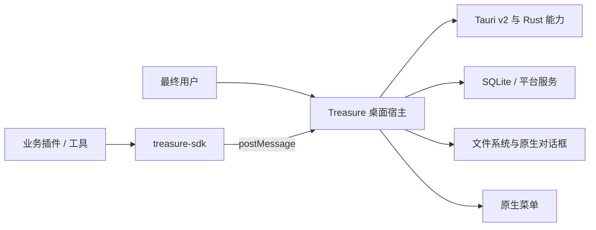
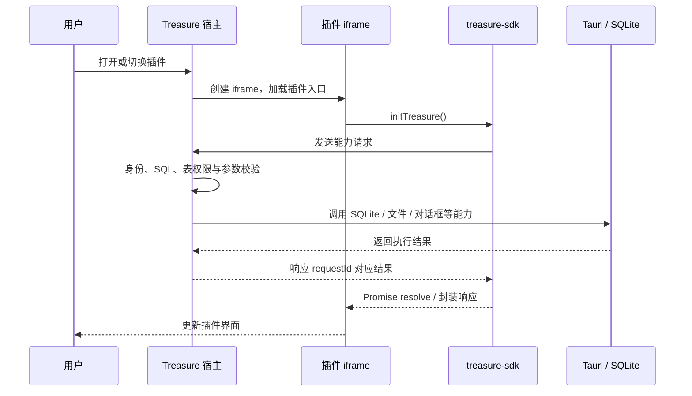
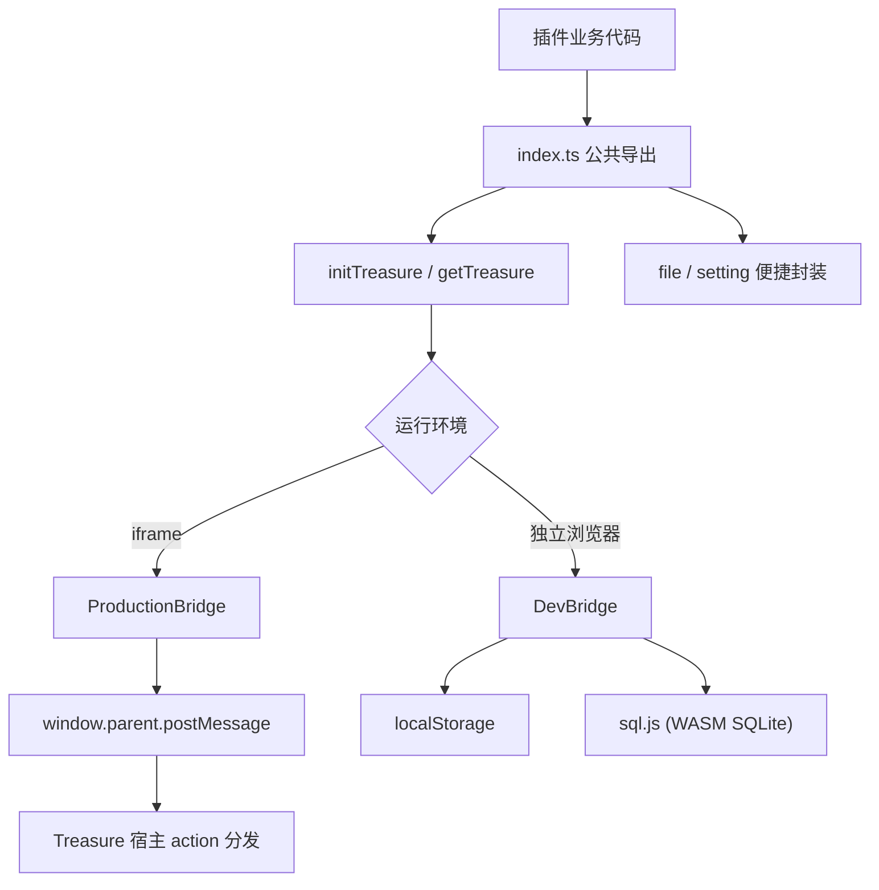
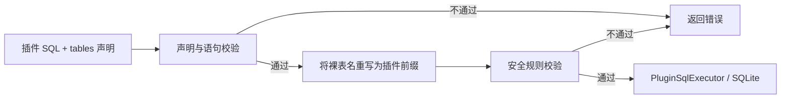

# Treasure SDK

[](https://www.npmjs.com/package/treasure-sdk)
[](LICENSE)
[](https://www.typescriptlang.org/)

**Treasure 插件 SDK** 是 [Treasure](https://github.com/Luzenrocy/treasure) 的官方插件开发工具包。它将插件与桌面宿主之间的交互收敛为稳定、类型化的 JavaScript API，并作为独立 npm 包发布：[`treasure-sdk`](https://www.npmjs.com/package/treasure-sdk)。

Treasure 在研发中将插件/工具与主程序解耦：一方面降低系统安装、运行时集成和独立调试的成本；另一方面将数据访问、安全校验和系统能力统一留在宿主侧控制。插件只需面向 SDK 编程，即可在受控边界内使用数据、文件、配置、系统对话框与原生菜单能力。

## 目录

- [项目定位](#项目定位)
- [生态与职责边界](#生态与职责边界)
- [产品原型与功能逻辑](#产品原型与功能逻辑)
- [技术架构](#技术架构)
- [核心能力](#核心能力)
- [SDK 使用与插件研发入口](#sdk-使用与插件研发入口)
- [插件使用 SDK 的开发与生产运行模型](#插件使用-sdk-的开发与生产运行模型)
- [数据安全模型](#数据安全模型)
- [SDK 开发与扩展](#sdk-开发与扩展)
- [文档导航](#文档导航)
- [项目结构](#项目结构)
- [贡献与许可](#贡献与许可)

## 项目定位

Treasure 是一个以插件扩展为核心的桌面应用平台。`treasure-sdk` 不是业务插件本身，也不直接承担桌面系统能力；它是连接插件前端与 Treasure 宿主的 **客户端桥接层**。

它解决三个关键问题：

| 目标 | SDK 的解决方式 |
| --- | --- |
| 降低插件开发门槛 | 以 npm 包提供统一 API、TypeScript 类型、Vue 插件模板与 CLI 脚手架。 |
| 兼顾独立开发与宿主集成 | 在浏览器中用 `localStorage + sql.js` 模拟运行；嵌入 Treasure 后自动切换为宿主桥接。 |
| 保护平台与插件数据 | SQL 在宿主侧验证、重写与执行；插件只能访问自身命名空间的数据表和配置。 |
| 保持桌面能力的统一入口 | 文件操作、目录/保存对话框、原生菜单等均由宿主实现，插件不直接耦合 Tauri API。 |

## 生态与职责边界

| 项目 | 角色 | 职责 |
| --- | --- | --- |
| [Treasure](https://github.com/Luzenrocy/treasure) | 桌面宿主 | 插件安装与加载、iframe 容器、Tauri 系统能力、SQLite 执行、权限与菜单注册中心。 |
| [treasure-sdk](https://github.com/Luzenrocy/treasure-sdk) | 本项目 | 定义通信契约，封装插件 API，提供开发态模拟器、CLI 和插件模板。 |
| [treasure-plugins](https://github.com/Luzenrocy/treasure-plugins) | 插件集合 | 承载面向用户的具体功能与工具实现。 |
| [Tauri v2](https://v2.tauri.app) | 桌面运行时 | 为 Treasure 宿主提供跨平台窗口、文件系统、系统对话框和 Rust 侧能力。 |



## 产品原型与功能逻辑

从用户视角，Treasure 提供一个可安装、可切换的工具工作台：用户在宿主中打开插件，插件以独立页面呈现业务界面；需要数据或系统能力时，SDK 将请求交由宿主执行并返回结构化结果。



### 插件生命周期

1. **宿主启动**：Treasure 注册桥接消息监听器和插件运行环境。
2. **插件加载**：用户打开插件后，宿主创建 iframe，加载插件包内的 `index.html`。
3. **SDK 初始化**：插件在 `app.mount()` 前调用 `initTreasure()`；SDK 根据是否处于 iframe 自动选择运行实现。
4. **能力调用**：插件通过桥接、`file` 或 `setting` 模块发起异步请求。
5. **宿主执行**：宿主按 `action` 分发，执行安全校验，再调用数据库、Tauri 文件系统或系统对话框。
6. **插件卸载**：标签页关闭时宿主注销该插件菜单，iframe 移除后通信自动断开。

## 技术架构

SDK 由“公开 API、桥接工厂、两套运行实现、开发工具”构成。



### 生产态：受控宿主桥接

生产环境中，插件运行在 Treasure 的 iframe 内。`ProductionBridge` 为每次调用分配 `requestId`，以 `postMessage` 将请求提交到父窗口，并将匹配的异步响应还原为 Promise。普通请求默认 10 秒超时；目录与保存对话框因等待用户操作而不设超时。

### 开发态：无需桌面宿主的本地模拟

独立浏览器中，`DevBridge` 用 `sql.js` 提供浏览器内 SQLite 模拟，并用 `localStorage` 保存数据库、插件配置和模拟文件。这样插件 UI 和常规数据逻辑可以先在 Vite 开发服务器中调试，再打包安装到 Treasure 验证原生能力。

> 开发态的目录选择、保存对话框使用 `prompt()` 模拟；菜单注册等依赖宿主的通道会返回“开发模式不可用”。浏览器站点数据被清除后，模拟数据也会丢失。

## 核心能力

| 能力域 | SDK 入口 | 说明 |
| --- | --- | --- |
| SQL 数据 | `getTreasure().query / execute / transaction` | 查询、写入和原子事务；插件使用裸表名，宿主负责安全校验与命名空间重写。 |
| 文件管理 | `file` 或桥接实例 | 文本/二进制文件读写、目录枚举、创建与删除；二进制内容采用 Base64。 |
| 配置管理 | `setting` 或桥接实例 | 插件私有配置的读取、批量保存、按键读取和保存，并兼容旧宿主降级策略。 |
| 系统对话框 | `selectDirectory`、`saveDialog` | 请求宿主打开目录选择或文件保存对话框。 |
| 菜单协作 | `request('registerMenu', ...)` 等 | 注册、注销和更新原生菜单状态；宿主可将菜单点击事件反向分发给当前活动插件。 |
| 日志与通知 | `log`、`sendNotification` | 可选的结构化日志与系统通知通道，依赖宿主实现版本。 |

所有响应遵循统一约定：`code === 1` 表示成功；`0` 为一般错误；`-1` 为参数错误；`-2` 为权限错误；`-3` 为未找到。

## SDK 使用与插件研发入口

`treasure-sdk` 的使用说明、插件研发流程与 SDK 自身开发是三类不同内容，分别由对应文档维护：

| 目标 | 应阅读的文档 | 内容边界 |
| --- | --- | --- |
| 在既有插件工程中接入 SDK | [API 参考](docs/API-REFERENCE.md) | 安装、初始化、公开方法、类型、参数、返回值和兼容性。 |
| 创建、调试和发布业务插件 | [插件研发指南](https://github.com/Luzenrocy/treasure-plugins/blob/main/docs/PLUGIN-DEVELOPMENT-GUIDE.md) | CLI 创建、manifest、独立开发、已安装宿主联调、构建与发布。 |
| 修改 SDK 的公开接口、桥接实现、CLI 或模板 | [SDK 开发与扩展指南](docs/SDK-DEVELOPMENT-GUIDE.md) | 源码分层、能力扩展链路、CLI/模板变更、构建与兼容性检查。 |

CLI 使用 `npx treasure-sdk create <plugin-code>` 按需下载并执行，不要求全局安装。生成的插件项目会在 `package.json` 中声明 `treasure-sdk`，且 CLI 默认执行 `npm install`；安装细节和失败处理见插件研发指南。

## 插件使用 SDK 的开发与生产运行模型

本节说明的是**业务插件在使用 SDK 时**，SDK 如何根据运行位置选择桥接实现；它不描述 `treasure-sdk` 仓库自身的开发、构建或扩展流程。后者请参阅 [SDK 开发与扩展指南](docs/SDK-DEVELOPMENT-GUIDE.md)。

| 场景 | 自动选择 | 数据来源 | 适合验证 |
| --- | --- | --- | --- |
| `npm run dev`，插件独立运行 | `DevBridge` | `localStorage` 与 `sql.js` | UI、常规 CRUD、配置逻辑和基础文件模拟。 |
| 插件包安装到 Treasure | `ProductionBridge` | Treasure 宿主、SQLite、Tauri | 权限、真实文件、系统对话框、菜单和插件生命周期。 |

环境检测基于 `window.parent !== window`。开发时请避免依赖模拟环境的持久化数据；上线前必须在 Treasure 中完成真实宿主验证。

## 数据安全模型

数据访问的核心原则是：**插件发起意图，宿主决定是否执行**。SDK 不是权限最终裁决者，所有关键 SQL 规则都由宿主实施。



- 插件查询、写入和事务必须显式声明使用到的 `tables`。
- 宿主将裸表名重写为 `plugin_{pluginCode}_{table}`，实现插件间表空间隔离。
- 宿主拒绝访问平台核心表，并限制 SQL 操作类型；`DROP`、`ALTER`、`RENAME TABLE` 等危险 DDL 不允许通过常规数据通道。
- 事务中的每一条 SQL 均需单独校验与重写。
- 配置读取和保存始终以 `pluginCode` 过滤，插件不会通过 SDK 指定其他插件的配置空间。
- 生产态中，插件身份取自页面声明的 `treasure-plugin-code`，请求与响应通过 `requestId` 关联。

> 文件操作由宿主 Tauri 文件能力执行。插件与宿主应将插件包视为受信任代码，并由宿主继续落实安装来源、路径范围和版本兼容性等策略；SDK 不替代宿主侧的文件权限治理。

## SDK 开发与扩展

本节面向维护 `treasure-sdk` 本身的开发者，而不是业务插件作者。SDK 的一项能力扩展通常需要同步调整公开类型与导出、生产/开发两套桥接实现、文档与模板；若新增桥接 action，还需和 Treasure 宿主保持同一协议版本。

详细的源码职责、接口扩展步骤、CLI/模板调整和发布前检查见 [SDK 开发与扩展指南](docs/SDK-DEVELOPMENT-GUIDE.md)。SDK 仓库的本地构建命令为：

```bash
npm install
npm run dev       # 监听构建 SDK
npm run build     # 产出 ESM、CJS、类型声明和 CLI
```

## 文档导航

README 说明 SDK 的定位、运行模型和工程组织；以下文档各自只承担一种职责：

| 文档 | 内容边界 |
| --- | --- |
| [桥接协议](docs/BRIDGE-PROTOCOL.md) | 请求/响应信封、action、反向事件、安全责任与版本兼容。 |
| [API 参考](docs/API-REFERENCE.md) | 公开方法、类型、参数、返回值和可选能力。 |
| [插件研发指南](https://github.com/Luzenrocy/treasure-plugins/blob/main/docs/PLUGIN-DEVELOPMENT-GUIDE.md) | 创建、manifest、调试、构建、发布和研发检查清单。 |
| [SDK 开发与扩展指南](docs/SDK-DEVELOPMENT-GUIDE.md) | SDK API、桥接实现、CLI 与模板的维护和扩展。 |

## 项目结构

```text
treasure-sdk/
├── src/
│   ├── index.ts                # 公共 API 入口
│   ├── types.ts                # TreasureBridge、响应和资源类型
│   ├── bridge.ts               # 单例工厂与环境检测
│   ├── bridge-impl/
│   │   ├── production.ts       # iframe + postMessage 实现
│   │   └── dev.ts              # localStorage + sql.js 模拟实现
│   ├── file.ts                 # 文件能力友好封装
│   ├── setting.ts              # 配置能力与兼容降级封装
│   └── cli/                    # treasure-sdk create 脚手架
├── template/                   # Vue 插件项目模板与打包脚本
├── docs/
│   ├── BRIDGE-PROTOCOL.md       # 宿主与 SDK 的通信协议
│   ├── API-REFERENCE.md         # SDK 公开接口参考
│   └── SDK-DEVELOPMENT-GUIDE.md # SDK 自身维护与扩展指南
└── package.json
```

## 相关文档

- [Treasure 主项目](https://github.com/Luzenrocy/treasure)
- [Treasure 插件集合](https://github.com/Luzenrocy/treasure-plugins)
- [treasure-sdk npm 包](https://www.npmjs.com/package/treasure-sdk)
- [Tauri v2 文档](https://v2.tauri.app)
- [桥接协议](docs/BRIDGE-PROTOCOL.md)
- [API 参考](docs/API-REFERENCE.md)
- [插件研发指南](https://github.com/Luzenrocy/treasure-plugins/blob/main/docs/PLUGIN-DEVELOPMENT-GUIDE.md)
- [SDK 开发与扩展指南](docs/SDK-DEVELOPMENT-GUIDE.md)

## 贡献与许可

欢迎通过 Issue 和 Pull Request 参与改进。提交涉及桥接协议时，请同时考虑生产态、开发态、类型定义、插件模板与宿主兼容性。

本项目采用 [Apache License 2.0](LICENSE) 许可。
