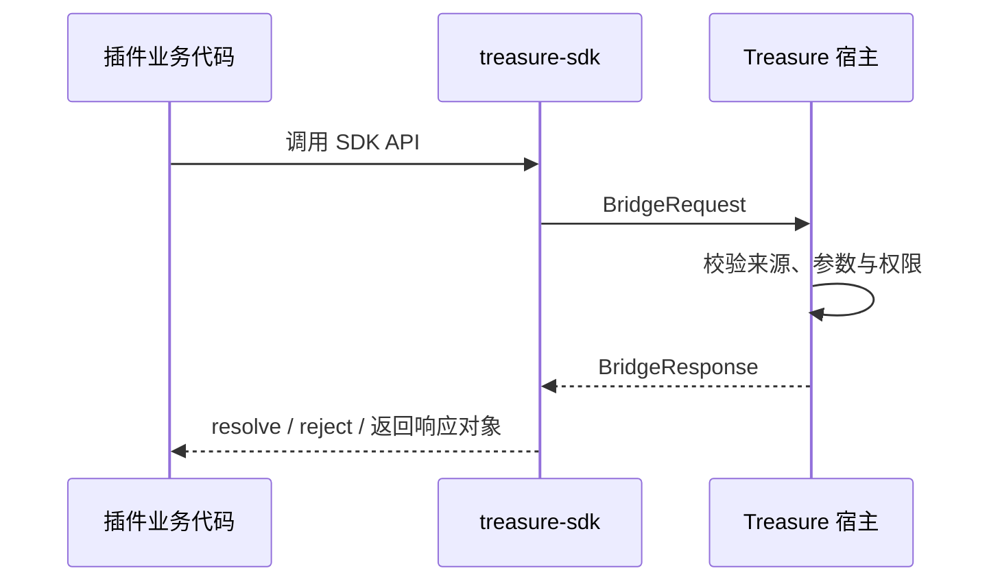

# Treasure 桥接协议

> 本文定义 Treasure 宿主与 `treasure-sdk` 之间的**底层通信契约**。它不介绍插件如何实现功能，也不逐一解释 SDK 方法；插件开发请参阅[插件研发指南](https://github.com/Luzenrocy/treasure-plugins/blob/main/docs/PLUGIN-DEVELOPMENT-GUIDE.md)，方法签名请参阅 [SDK API 参考](API-REFERENCE.md)。

## 1. 范围与术语

| 名称 | 含义 |
| --- | --- |
| 宿主 | Treasure 桌面应用，负责加载插件、裁决权限与执行原生能力。 |
| SDK | `treasure-sdk` 包，对插件暴露稳定的类型化接口。 |
| 插件 | 由宿主以 iframe 加载的独立 Web 应用。 |
| 桥接协议 | SDK 生产态与宿主之间传递请求、响应和事件的消息约定。 |

插件业务代码必须调用 SDK API，不能自行拼装桥接消息。宿主实现需要遵守本协议，SDK 负责将协议细节封装为 Promise API。

## 2. 请求与响应信封

生产态使用 `window.postMessage` 传输；消息名称为历史兼容名称，并不代表能力只限于数据库。

```ts
interface BridgeRequest {
  type: 'treasure-db-request';
  requestId: string;
  pluginCode: string;
  action: string;
  // action 对应的 JSON 可序列化载荷
}

interface BridgeResponse<T = unknown> {
  type: 'treasure-db-response';
  requestId: string;
  code: 1 | 0 | -1 | -2 | -3;
  msg?: string;
  data?: T;
}
```

| 字段 | 规则 |
| --- | --- |
| `requestId` | 由 SDK 在单个插件页面中生成；宿主必须原样回传。 |
| `pluginCode` | SDK 从页面 `meta[name="treasure-plugin-code"]` 取得；宿主据此定位插件上下文。 |
| `action` | 标识受支持的宿主能力；未知 action 必须以错误响应拒绝。 |
| `code` | `1` 成功，`0` 通用错误，`-1` 参数错误，`-2` 权限错误，`-3` 未找到。 |

## 3. 消息时序



- 普通请求默认超时为 10 秒。
- 目录选择、保存文件等需要用户交互的请求不设置 SDK 超时。
- 响应必须携带匹配的 `requestId`；SDK 忽略不匹配或未知的响应。
- 插件页面销毁时，SDK 应清理待处理请求和事件监听。

## 4. Action 约定

Action 是协议层的能力标识；参数形状和调用方式以 [SDK API 参考](API-REFERENCE.md) 为准。

| 能力域 | Action |
| --- | --- |
| 数据 | `query`、`execute`、`transaction` |
| 文本与二进制文件 | `readFile`、`readBinaryFile`、`readDir`、`writeFile`、`writeBinaryFile`、`createFile`、`updateFile`、`createDir`、`mkdir`、`deleteFile`、`deleteDir` |
| 系统对话框 | `selectDirectory`、`saveDialog` |
| 插件设置 | `getSettings`、`saveSetting`、`getSettingByKey`、`saveSettingByKey` |
| 菜单协作 | `registerMenu`、`unregisterMenu`、`updateMenuState` |
| 可选宿主能力 | `log`、`sendNotification` |

新增 action 时，必须同时更新宿主分发实现、SDK 类型与生产/开发态实现，并在本表登记；这是一项兼容性变更。

## 5. 宿主反向事件

当前定义的宿主反向事件如下：

```ts
interface MenuEvent {
  type: 'treasure-menu-event';
  menuId: string;
  itemId: string;
}
```

宿主只将菜单事件发送给对应的活动插件页面。插件可监听该事件并更新业务状态；事件不保证持久化或重放。

## 6. 安全与兼容性责任

- SDK 提供调用入口，不是权限裁决者；宿主必须验证请求来源、插件身份、参数和操作权限。
- 数据请求必须由宿主进行表声明校验、命名空间重写与 SQL 安全检查。
- 协议消息仅可包含 JSON 可序列化数据；二进制内容使用 Base64。
- 新增字段应保持可选并向后兼容；删除或改变既有字段语义应提升主版本号。
- 插件应通过可选 API 的存在性检测兼容旧宿主，不能假定新能力在所有平台版本中可用。

## 7. 关联文档

- [SDK API 参考](API-REFERENCE.md)
- [插件研发指南](https://github.com/Luzenrocy/treasure-plugins/blob/main/docs/PLUGIN-DEVELOPMENT-GUIDE.md)
- [Treasure 宿主](https://github.com/Luzenrocy/treasure)
